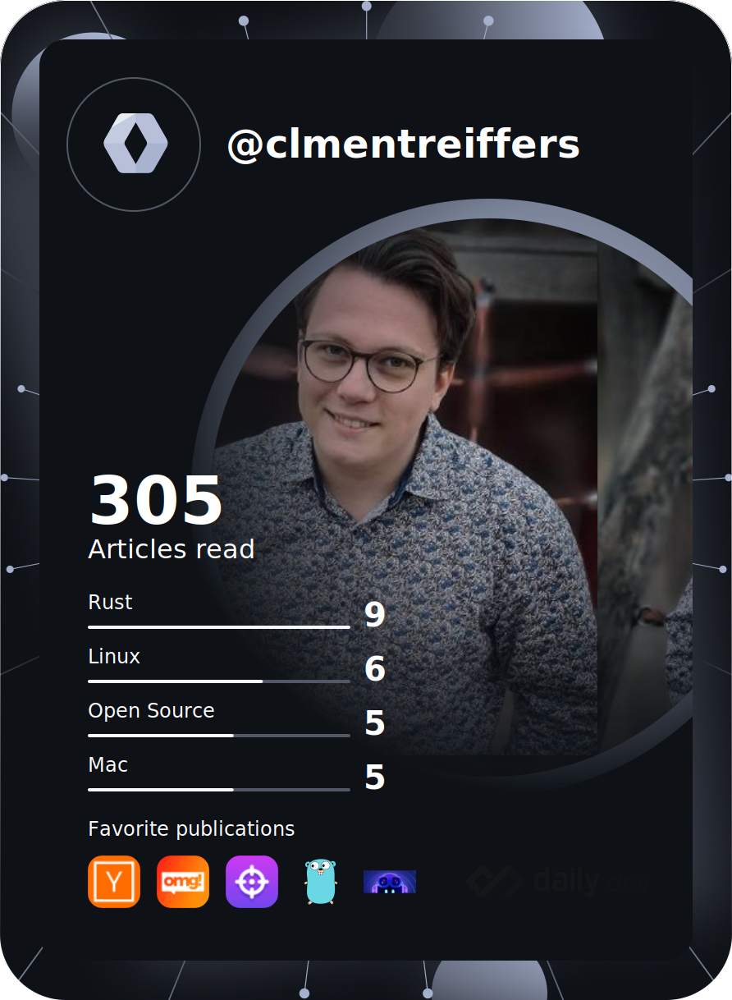

<h1 align="center">Hi , I'm Clément Reiffers !</h1>
<h3 align="center">A guy who got married to his keyboard</h3>

  

- 🔭 I’m currently working on [Cloudflare Workers](https://clementreiffers.github.io/octo-workers-docs/)

- 🌱 I’m currently learning **Kubernetes, DevOps tools, AI and much programming languages!**

- 💬 Ask me about **Any projects you want to start !**

- 📫 How to reach me **reiffersclement@gmail.com**

<h3 align="left">Connect with me:</h3>

<h3 align="left">Languages and Tools:</h3>

                                      

&nbsp;

