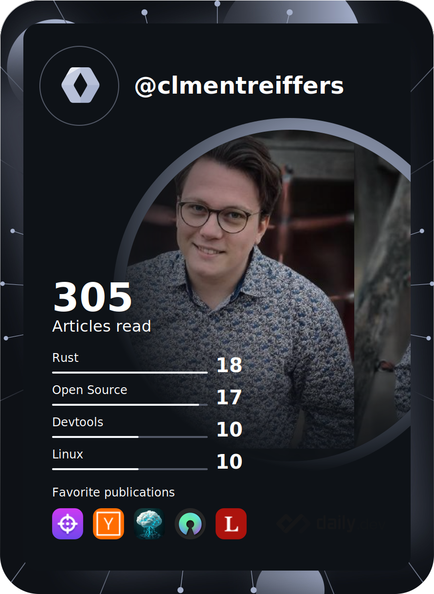

<h1 align="center">Hi , I'm Clément Reiffers !</h1>
<h3 align="center">A guy who got married to his keyboard</h3>

  

I wrote an article "[Unleashing the power of WebAssembly](https://blog.revolve.team/2024/01/16/unleashing-the-power-of-webassembly-in-cloud-computing/)" don't hesitate to give me your opinion about this!

- 🔭 I’m currently studying [WebAssembly](https://webassembly.org/) for cloud architecture

- 🌱 I’m currently learning **AWS, Kubernetes, DevOps tools, AI and much programming languages!**

- 💬 Ask me about **Any projects you want to start !**

- 📫 You can reach me with [**clement.reiffers@outlook.fr**](mailto:clement.reiffers@outlook.fr) or [LinkedIn](https://www.linkedin.com/in/cl%C3%A9ment-reiffers-bb8983185/?originalSubdomain=fr)

<h3 align="left">Connect with me:</h3>

<h3 align="left">Languages and Tools:</h3>

 

 
 
 

 
 
 
 
 

&nbsp;

